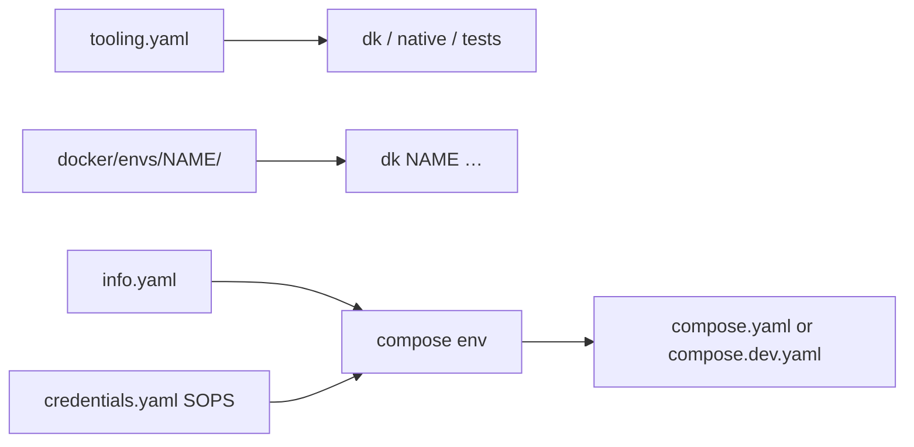

# Quickstart: add catalpa-workspace-tooling to an existing project

This guide is for **application repositories** that do not contain this
library. You install the package as a dependency, then teach the tooling how
_your_ repo is laid out. Dockerizing the app itself is out of scope here; this
document covers only what the tooling **requires** and the compose conventions
that keep `dk` / `native` reliable.

Run every command from the **application repo root** (the directory that will hold `tooling.yaml`), not from a checkout of `catalpa-workspace-tooling`.

## What you are installing

The package adds console scripts to the consumer venv:

| Command   | Role                                                                                             |
| --------- | ------------------------------------------------------------------------------------------------ |
| `dk`      | Docker Compose per **deploy environment**, plus host/DNS, backups, image push, local HTTPS proxy |
| `native`  | Host-side Django / frontend / fetch helpers (no Docker, except when fetching from a `dk` env)    |
| `tests`   | CI / guest / functional stack tests (optional)                                                   |
| `scripts` | Auto-discovered `scripts/*.sh` helpers                                                           |

Behavior is driven by a repo-root **`tooling.yaml`**. Environments are folders under `docker/envs/<name>/` (or whatever `paths.deploy.envs_dir` you set). `dk <env> …` loads that folder’s `info.yaml` + SOPS `credentials.yaml`, sets `DOCKER_HOST`, and runs Compose.



## Prerequisites

- Python 3.12+ and [uv](https://docs.astral.sh/uv/)
- Docker Engine + **Docker Compose 2.24+** (local HTTPS proxy uses `ports: !reset []`)
- For remote deploy: `sops`, `age` (or your team’s SOPS backend), SSH access
- For DigitalOcean workflows: host `doctl` on `PATH` (see [README.md](README.md#digitalocean-pat-scopes))
- For `dk push` / GHCR cleanup: `gh` with package scopes (see [README.md](README.md#github-pat-scopes-ghcr))

## 1. Add the package to the application repo

Pin a **released tag** (do not track `main` in production apps):

```bash
uv add --group tooling "catalpa-workspace-tooling @ git+https://github.com/catalpainternational/catalpa-workspace-tooling@v1.0.0"
# Optional: tab completion for dk / native / …
uv add --group tooling 'catalpa-workspace-tooling[completion]'
uv sync
```

Use `--editable ../catalpa-workspace-tooling` only when you are developing the library itself.

Confirm the CLIs resolve from **this** repo’s venv:

```bash
uv run dk --help
```

Optional but recommended: copy [`scripts/envrc.template`](scripts/envrc.template) to `.envrc`, run `uv run setup-shell` once per machine, then `direnv allow`. See [README.md](README.md#shell-completion-optional).

Copy agent guardrails so Cursor does not decrypt secrets or hit staging/prod by accident: [docs/AGENTS_AND_SECRETS.md](docs/AGENTS_AND_SECRETS.md).

## 2. Layout the tooling expects

Minimum tree (names can change if `tooling.yaml` paths match):

```text
your-app/
  tooling.yaml                 # required
  pyproject.toml               # typical project.root_marker
  compose.yaml                 # prod-like stack (paths.deploy.default_compose)
  compose.dev.yaml             # local bind-mount / Vite stack (paths.deploy.dev_compose)
  docker/
    images.yaml                # registry default (paths.deploy.images_config)
    envs/
      dev/
        info.yaml              # required to appear as `dk dev`
      full/
        info.yaml              # optional local prod-like
      staging/
        info.yaml
        credentials.yaml       # SOPS; required unless env is credentials-optional
        credentials.example.yaml
      prod/
        info.yaml
        credentials.yaml
  .sops.yaml                   # who may encrypt/decrypt credentials
  .env.local                   # host `native` only — not merged into `dk`
```

**Split secrets from env metadata.** `info.yaml` is committed plaintext (hosts, origins, compose file, non-secret `env:`). `credentials.yaml` is SOPS-encrypted. Keys in both files are **uppercased** when passed to Compose (`compose_project_name` → `COMPOSE_PROJECT_NAME`). Nested maps/lists in credentials are ignored.

Local-only envs (`dev`, `full`, or names starting with `local_`) can omit credentials if you list them under `paths.deploy.credentials_optional_envs`.

## 3. Write `tooling.yaml`

Start from [tests/fixtures/minimal_project/tooling.yaml](tests/fixtures/minimal_project/tooling.yaml) or a production consumer (ambulancia, JID, catalpa-site). Required top-level keys: `project`, `paths`, `stack`, `ops`.

### `project` and `paths`

| Key                                            | Purpose                                                                 | Notes                                                       |
| ---------------------------------------------- | ----------------------------------------------------------------------- | ----------------------------------------------------------- |
| `project.name`                                 | Slug for droplet names (`{name}-{env}`) and default localdev hostnames. | Prefer hyphens; underscores become hyphens on DigitalOcean. |
| `project.root_marker`                          | File that must exist at repo root (usually `pyproject.toml`).           |                                                             |
| `paths.backend`                                | Django project dir for `native manage` / `runserver`.                   |                                                             |
| `paths.frontend`                               | Frontend dir for `native frontend` and smoke tests.                     | Bero stacks use `bero`.                                     |
| `paths.scripts`                                | One directory or an **ordered list** (earlier wins on name clash).      |                                                             |
| `paths.env_local`                              | Host env file for `native` (not `dk`).                                  |                                                             |
| `paths.email_backend_dir`                      | Default `EMAIL_BACKEND_FOLDER` for host Django.                         |                                                             |
| `paths.fetch_db_dump`                          | Default dump path for `native fetch db` / `dk fetch db`.                | Use dk fetch media/db for Ansible hosts                     |
| `paths.deploy.envs_dir`                        | Usually `docker/envs`.                                                  |                                                             |
| `paths.deploy.images_config`                   | Usually `docker/images.yaml`.                                           |                                                             |
| `paths.deploy.default_compose` / `dev_compose` | Prod-like vs local compose files.                                       |                                                             |
| `paths.deploy.credentials_optional_envs`       | Envs that may run without `credentials.yaml`.                           |                                                             |
| `paths.deploy.env_aliases`                     | Optional `dk` name → folder name (e.g. `local: dev`).                   |                                                             |

Override the manifest path with `TOOLING_CONFIG=/path/to/tooling.yaml` if needed; the parent of that file is treated as the repo root.

### `stack` (must match Compose)

| Key                                   | Purpose                                                                                   | Notes                                                                                        |
| ------------------------------------- | ----------------------------------------------------------------------------------------- | -------------------------------------------------------------------------------------------- |
| `stack.compose_project_default`       | Fallback Compose project name.                                                            | Local: `{default}_{env}` if unset; remote: `{default}` unless `env.compose_project_name`.    |
| `stack.services.web` / `proxy` / `db` | **Compose service names**, not container names.                                           | Used by `dk <env> manage`, backups, health, local proxy. Typical: `django` / `caddy` / `db`. |
| `stack.images.registry_key`           | Key in `docker/images.yaml` (usually `image_registry`).                                   |                                                                                              |
| `stack.images.components`             | Image **repository names** under the registry (`web` / `proxy` / `db`).                   | e.g. `myapp`, `myapp-caddy`, `myapp-postgres`. Used by `dk push` and injected `*_IMAGE`.     |
| `stack.healthcheck`                   | Service + URL for smoke / wait-for-healthy.                                               |                                                                                              |
| `stack.origin_env_keys`               | Optional; defaults include `SITE_ORIGIN`, `DJANGO_ORIGIN`, `BERO_ORIGIN`.                 |                                                                                              |
| `stack.build_placeholders`            | Dummy secrets so `dk build` / `dk push` can interpolate Compose without real credentials. |                                                                                              |

### `ops` (backups, systemd, transfer)

Even if you are not enabling backups on day one, the parser **requires** `ops.pgbackrest`, `ops.zabbix`, and `ops.systemd_units`. Copy the minimal fixture and rename prefixes to your slug. Important fields:

| Key                                                         | Purpose                                                   | Notes                                                          |
| ----------------------------------------------------------- | --------------------------------------------------------- | -------------------------------------------------------------- |
| `ops.install_prefix` / `config_dir` / `systemd_unit_prefix` | Paths and unit names on the deploy host.                  |                                                                |
| `ops.transfer_workdir`                                      | Scratch dir for `dk transfer`.                            |                                                                |
| `ops.default_db_container`                                  | Fallback container name for systemd / backup helpers.     | e.g. `myapp-db-1`. Must match real Compose naming on the host. |
| `ops.pgbackrest.data_volume`                                | Compose **volume key** for PGDATA.                        | Default `postgres_data`; ambulancia uses `pgdata`.             |
| `ops.restic.data_volume`                                    | Compose volume key for media (default `django_media`).    |                                                                |
| `ops.pgbackrest.default_registry`                           | GHCR (or other) prefix for the Postgres image in backups. |                                                                |

Volume keys you later bind with `storage.volumes` in `info.yaml` must be one of: restic data volume, pgBackRest data volume, or `caddy_data`.

### `digitalocean` (defaults for `dk <env> host create`)

Add this when the first remote env will be a DigitalOcean droplet. Per-env overrides go in `docker/envs/<env>/info.yaml` (see §4). For `size` and `region`, resolution is **CLI flag → env `info.yaml` → `tooling.yaml`**.

```yaml
digitalocean:
  project_name: my-do-project
  context: default # optional host doctl auth context
  timezone: Asia/Dili
  region: sgp1
  size: s-2vcpu-4gb
  image: ubuntu-24-04-x64
  ssh_keys:
    - "aa:bb:cc:..." # fingerprint or ID from `doctl compute ssh-key list`
  monitoring: true # default; pass `--no-monitoring` or set false to skip do-agent
```

The droplet hostname defaults to **`{project.name}-{env}`** (underscores become hyphens). SSH keys on the DigitalOcean account are embedded unless you set `ssh_keys` or pass `--ssh-key`. Cloud-config installs Docker CE, UFW, unattended upgrades, and SSH key-only login.

Optional later: `native:`, `dev:`, `compliance:`, `ops.post_db_restore`. See [docs/NATIVE_COMMAND_TREE.md](docs/NATIVE_COMMAND_TREE.md) and the topic READMEs.

## 4. Create deploy environments

An environment exists when `docker/envs/<name>/info.yaml` exists. Common set:

| Env                | `docker_host`        | Compose file       | Typical use                     |
| ------------------ | -------------------- | ------------------ | ------------------------------- |
| `dev`              | unset (local)        | `compose.dev.yaml` | Bind mounts, Vite, runserver    |
| `full`             | unset / local socket | `compose.yaml`     | Prod-like images on your laptop |
| `staging` / `prod` | `ssh://user@host`    | `compose.yaml`     | Remote Docker via SSH           |

### `info.yaml` (non-secret)

Useful keys:

```yaml
# docker/envs/dev/info.yaml
compose_file: compose.dev.yaml # default: paths.deploy.default_compose
image_registry: "" # empty → build locally, do not pull tagged GHCR images
env:
  django_debug: "true" # → DJANGO_DEBUG
# local_proxy is on by default for local engines; opt out with enabled: false
```

```yaml
# docker/envs/staging/info.yaml
compose_file: compose.yaml
site_origin: https://myapp-staging.example.org
# docker_host: ssh://root@203.0.113.5   # set by `dk staging host create` / `host --write`
image_registry: ghcr.io/catalpainternational/myapp
image_tag: v1.2.3 # pin pulled images; or pass `dk staging --tag v1.2.3`
digitalocean:
  ssh_user: root
  size: s-2vcpu-4gb
  region: sgp1
env:
  compose_project_name: myapp-staging
```

Rules that bite newcomers:

- **`site_origin`** (hostname, URL, or list) is the source of truth. Tooling derives `SITE_ORIGIN`, `DOMAIN`, and (unless you override them) `CADDY_*_SITE_ADDRESS`. Prefer this over a deprecated top-level `domain`.
- **`redirect_origins`** are TLS-terminating redirects only — not app hosts. Do not list the same host in both fields.
- **`image_tag` + `image_registry`**: when both are set, `dk` pulls pre-built images and sets `Django_IMAGE` / `Caddy_IMAGE` / `Postgres_IMAGE`. For local `dev`/`full`, leave registry empty so you build from Dockerfiles.
- **`env.compose_project_name`**: set it on **remote** envs so containers/volumes stay `{project}-db-1` / `{project}_pgdata` regardless of the checkout directory name. If Compose also uses `name: ${PROJECT_NAME}`, set **`PROJECT_NAME`** to the same value.
- **`digitalocean.disabled: true`**: datacenter / TIC hosts with a hand-maintained `docker_host` (no droplet or DO DNS API).
- **`credentials_decrypt_optional: true`**: `dk` continues if SOPS fails — backups then fail later for a confusing reason. Prefer fixing SOPS.

Local HTTPS (`*.localdev.temp.build`) is documented in [README_DEV_PROXY.md](README_DEV_PROXY.md). Default hostname is `{project-slug}-{env}.localdev.temp.build`. Trust the machine CA once: `dk proxy trust` or `dk dev trust-caddy-cert`.

### `credentials.yaml` (secret)

1. Add `.sops.yaml` `creation_rules` for `docker/envs/.*/credentials.yaml` (and `dc-backup*` if you use closed-DC backup).
2. Copy `credentials.example.yaml` → `credentials.yaml`, fill values, encrypt: `sops -e -i docker/envs/staging/credentials.yaml`.
3. Later edits: `uv run dk staging secrets` (opens SOPS), not a plaintext commit.

Credential keys become Compose env (`postgres_password` → `POSTGRES_PASSWORD`). They **override** the same key from `info.yaml` `env:`.

Never print `sops -d` output into chat or CI logs. Safe check: `sops -d docker/envs/staging/credentials.yaml >/dev/null && echo OK`.

### `docker/images.yaml`

```yaml
image_registry: ghcr.io/catalpainternational/myapp
```

Used when `info.yaml` does not set `image_registry`. Image tags default to git tag-at-HEAD, else branch, else `git describe`, else `latest`.

## 5. Organize Compose for this tooling

This is not a general Docker tutorial. These conventions are what `dk` actually calls.

### Service roles

Declare three **roles** in `tooling.yaml` and use those exact Compose service names:

- **`db`** — Postgres. `dk <env> db …`, `dk transfer`, and `tests ci` exec this service. Give it a healthcheck (`pg_isready`). Keep the service name stable (`db` is the usual choice).
- **`web`** — the container that has `./manage.py` on `PATH` / `WORKDIR` (`dk <env> manage`, post-restore hooks, smoke empty-migrate). Extra workers (`listen`, `migrate` oneshot) can share the same image; only the role name is special.
- **`proxy`** — Caddy (or equivalent) listening on **container port 80**. The machine-wide local proxy attaches this service to `catalpa-local-proxy-net` and strips published host ports. Dev backends (Vite, runserver) stay **internal**; Caddy is the only front door.

You may add redis, Metabase, `node`, oneshots, etc. They are invisible to role-based commands unless you wire them in scripts.

### Two compose entry files

- **`compose.yaml`** (or `compose.yml`): production-like — built SPA, no bind-mounted source, secrets required for remote.
- **`compose.dev.yaml`**: local overrides (bind mounts, Vite, insecure defaults). Point `dev`’s `compose_file` here.

A shared `include:` of a base stack plus a thin override file (as ambulancia does with `stack.base.yaml`) keeps service names and volume keys identical across envs. That stability matters more than how you split YAML.

### Images: interpolate what `dk` injects

On deploy, tooling sets some or all of:

- `STACK_IMAGE_REGISTRY`, `STACK_IMAGE_TAG`
- `Django_IMAGE`, `Caddy_IMAGE`, `Postgres_IMAGE` when registry **and** tag are known
- `VITE_RELEASE`, `VITE_BUILD_TIME`, `VITE_GIT_SHA` (for SPA build args)
- `SITE_ORIGIN`, `DOMAIN`, `CADDY_SITE_ADDRESS` (and optional admin/stats variants)
- `DOCKER_HOST`, `DJANGO_DEBUG` (defaults to `0` if unset)
- `COMPOSE_PROJECT_NAME` (if you did not set it)

Compose should consume those instead of hard-coding registry tags for the three stack images, for example:

```yaml
db:
  image: ${Postgres_IMAGE:-${STACK_IMAGE_REGISTRY:-ghcr.io/org/myapp}/myapp-postgres:${STACK_IMAGE_TAG:-latest}}
  build:
    context: ./docker/postgres
```

`dk build` / `dk push` use `paths.deploy.default_compose` and `stack.build_placeholders` so required `${SECRET}` interpolations have dummy values. Add any extra required build-time keys to `stack.build_placeholders`.

Push builds **linux/amd64** for DigitalOcean droplets. Set `platform: linux/amd64` on those services if developers use Apple Silicon.

### Volumes: stable keys, explicit project prefix

Tooling looks up volumes by **Compose key**, then the Docker name `{COMPOSE_PROJECT_NAME}_{key}`:

| Concern                                        | Default key     | Override                     |
| ---------------------------------------------- | --------------- | ---------------------------- |
| Postgres data                                  | `postgres_data` | `ops.pgbackrest.data_volume` |
| Django media (restic / transfer / fetch media) | `django_media`  | `ops.restic.data_volume`     |
| Caddy data (optional host bind)                | `caddy_data`    | —                            |

Good practice:

```yaml
volumes:
  pgdata:
    name: ${COMPOSE_PROJECT_NAME:-myapp}_pgdata
  django_media:
    name: ${COMPOSE_PROJECT_NAME:-myapp}_django_media
  caddy_data:
    name: ${COMPOSE_PROJECT_NAME:-myapp}_caddy_data
```

If you omit `name:`, Compose still creates `{project}_{key}`, but **`COMPOSE_PROJECT_NAME` must be set** the same way `dk` sets it. Do not rely on the checkout directory as the project name (that is what happens with a bare `docker compose up` and it will not match `dk`).

Media mounts: named volume **or** a bind whose container target is `/django_media` or `/media` (see `media_storage.py`). Transfer and `dk <env> files` resolve through merged `compose config`.

Host bind on a droplet (optional) in `info.yaml`:

```yaml
storage:
  volumes:
    django_media:
      path: /mnt/myapp-media
```

`dk <env> up` / `storage ensure` pre-creates those named volumes. You do **not** need `external: true` in Compose for binds to work.

### Caddy and origins

- Stack Caddy must use `CADDY_SITE_ADDRESS` (and optional `CADDY_DJANGO_SITE_ADDRESS` / `CADDY_METABASE_SITE_ADDRESS` / `CADDY_REDIRECT_SITE_ADDRESSES`).
- Behind the local proxy, tooling injects **`http://`** addresses (proxy terminates TLS). On remote deploy it injects **`https://`** so Caddy can obtain certificates.
- Explicit `env:` values win over injection (`setdefault`).
- Extra local hostnames: `local_proxy.roles: [admin]` and/or `[stats]` (subdomains of the primary localdev host).

### Postgres image and `pgbackrest.conf`

Tooling materializes stanza / `pg1-path` / S3 into the **`pgbackrest_conf` volume** (`/etc/pgbackrest/conf.d/…`). The file baked into the Postgres image is only for process paths the `postgres` user can write (`lock-path`, `log-path`, `spool-path`) plus comments. **Do not set `pg1-path` (or `repo1-*`) in the image file** — that duplicates the drop-in and pgBackRest exits `[031]`. Create and `chown` those lock/log/spool directories in the Dockerfile. Consumer examples: bero / Indmo `docker/postgres/pgbackrest.conf`.

`dk <env> db restore` / `files restore` are for backups **this stack** wrote. To load an Ansible-era or package-install cluster, use a custom-format dump (`db pgrestore` / `db restore --dumps`) and `dk fetch media` + `files push` ([TROUBLESHOOTING.md](TROUBLESHOOTING.md#h-seeding-a-new-docker-host-from-ansible--native-backups)).

### Django / smoke-test env names

`tests ci` empty-migrate sets `DJANGO_DB` / `POSTGRES_DB`. The app must read the database **name** from `DJANGO_DB` (not only `DJANGO_DB_NAME`). See [docs/SMOKE_TESTS.md](docs/SMOKE_TESTS.md).

Host `native` uses `paths.env_local` and a different default (`localhost:5432`). Do not assume `.env.local` is visible inside Compose.

### What not to do

- Do not treat this git repo as the place to put application Dockerfiles. Keep images and Compose in the **app** repo; this package only reads paths you declare.
- Do not put production secrets in `info.yaml` or compose defaults that are committed for remote envs.
- Do not name remote Compose projects after a developer’s clone directory.
- Do not publish Caddy `:80`/`:443` on the host for local `dk dev` if you use the shared proxy — tooling clears those ports so only `catalpa-local-proxy` binds 80/443.
- Do not change `stack.services.*` without renaming the Compose services to match.

## 6. First local run

```bash
# Validate merge (no remote, no secret dump needed for structure)
uv run dk dev config --services

uv run dk proxy up          # once per machine; then trust CA
uv run dk proxy trust

uv run dk dev up -d
uv run dk dev ps
# Site: https://<project>-dev.localdev.temp.build
```

If Compose is invalid, fix service names / interpolations locally. Do not debug by running `dk staging config` (that decrypts remote secrets into the process env).

Host workflow (optional, Postgres on the machine or `dk dev up -d db`):

```bash
uv run native manage migrate
uv run native start          # Honcho: runserver + frontend
```

## 7. First remote environment (DigitalOcean droplet and deploy)

Prefer `dk <env> host create` over a raw `dk digoc droplets create` so the env is named, linked, and DNS-synced in one flow. Examples use `staging`; `prod` is the same once `docker/envs/prod/info.yaml` exists.

### Define the env

1. Commit `tooling.yaml` (including the `digitalocean:` block from §3), compose files, `docker/images.yaml`, `docker/envs/staging/info.yaml`, `credentials.example.yaml`, and `.sops.yaml`.
2. Create encrypted `credentials.yaml` on a machine that has the team age key. Confirm without printing secrets: `sops -d docker/envs/staging/credentials.yaml >/dev/null && echo OK`.
3. In `info.yaml`, set `site_origin` to a hostname (or URL) on a **DigitalOcean-managed** DNS zone when you want `host create` to write A records. Also set `env.compose_project_name` (and `PROJECT_NAME` if Compose uses it). Leave `docker_host` unset — `host create` writes it.

Override droplet name, SSH user, size, region, or DNS TTL per env:

```yaml
# docker/envs/staging/info.yaml
digitalocean:
  droplet_name: my-hostname # optional; default {project.name}-{env}
  ssh_user: root
  size: s-2vcpu-4gb
  region: sgp1
  dns_ttl: 3600 # optional; default 300
```

### Auth

4. Install host `doctl`. Run `uv run dk digoc auth init` once per machine (remove a stale token with `dk digoc auth remove --context default`, or pass `-t TOKEN`).
5. The PAT must be able to **create a droplet and write DNS**. **Full Access** (`api:write`) is the simple choice. Granular scopes and 403 recipes: [README.md](README.md#digitalocean-pat-scopes).
6. SSH keys must already exist on the DigitalOcean account. If the token cannot list keys, pass `--ssh-key ID` (repeatable) or set `digitalocean.ssh_keys`.

### Provision

7. Dry-run, then create (waits until the droplet is active, patches `docker_host`, registers `~/.ssh/known_hosts`, syncs DO A records for `site_origin` / `redirect_origins`):

```bash
uv run dk staging --dry-run host create
uv run dk staging host create
```

`--dry-run` is an env-level flag: it must sit **after** `staging` and **before** `host`. Trailing `--dry-run` is rejected by the top-level `dk` parser. Create-only flags (`--size`, `--ssh-key`, …) go after `create`, or after `--` if argparse treats them as unknown.

8. **Commit** the patched `docker_host` in `info.yaml` so other machines and agents see the remote env.
9. Verify (read-only against the droplet and DNS; agent sessions still need your confirmation because it talks to infra):

```bash
uv run dk staging host
```

Stuck after a partial create (SSH not up, DNS, wrong DO project): [TROUBLESHOOTING.md](TROUBLESHOOTING.md#host-create-and-dns).

### Push images and deploy

10. GitHub Container Registry: `dk push` uses `gh auth token` (or `GH_TOKEN` / `GITHUB_TOKEN`). A default `gh auth login` often lacks package scopes:

```bash
gh auth refresh -s read:packages,delete:packages,write:packages
```

`write:packages` is enough for the first push. Full GHCR scopes and cleanup 403s: [README.md](README.md#github-pat-scopes-ghcr).

11. `uv run dk push` — build **linux/amd64**, push to GHCR, attach SBOMs (unless `--no-sbom`).
12. Pin `image_tag` in `info.yaml` (or pass `--tag`) **and** keep `image_registry` set so the remote host pulls `Django_IMAGE` / `Caddy_IMAGE` / `Postgres_IMAGE`. Then:

```bash
uv run dk staging up -d
uv run dk staging ps
# first boot, if the app needs it:
uv run dk staging manage migrate
```

To copy **application data** from a pre-Docker / Ansible host, do **not** run `dk staging db restore` or `dk staging files restore`. Those replay this stack’s pgBackRest and restic layouts (and `db restore` is offline pgBackRest whenever `pgbr_s3_read_*` / `pgbr_s3_write_*` are set). Dump the old cluster (`pg_dump -Fc`) into `paths.fetch_db_dump`, then `uv run dk staging db pgrestore` or `uv run dk staging db restore --dumps`. For media: `uv run dk fetch media` then `uv run dk staging files push`. Details: [TROUBLESHOOTING.md](TROUBLESHOOTING.md#h-seeding-a-new-docker-host-from-ansible--native-backups).

Commit `image_tag` when you want that pin shared.

### Activate protection against accidental deploys

13. Confirm the consumer repo has `.cursorignore` plus `.cursor/rules/secrets-and-agents.mdc` and `remote-environments.mdc` ([docs/AGENTS_AND_SECRETS.md](docs/AGENTS_AND_SECRETS.md)). After `docker_host` is committed, those rules treat this env as **remote** and require an explicit yes before `dk staging …`, `dk push`, transfer, or fetch. That is the tooling’s accidental-deploy protection (not a DigitalOcean deletion-protection flag).

Later: backups ([README_PGBACKREST.md](README_PGBACKREST.md), [README_RESTIC.md](README_RESTIC.md)), systemd ([README_SYSTEMD.md](README_SYSTEMD.md)), Zabbix ([ZABBIX_README.md](ZABBIX_README.md)). Host binds / DO block volumes: [README.md](README.md#host-storage-storage-in-infoyaml).

Non-DO / TIC host: set `digitalocean.disabled: true` and maintain `docker_host` yourself (`host create` / `host --write` are not available).

## 8. Sanity checklist

- [ ] `tooling.yaml` loads: `uv run dk --help` lists your env names.
- [ ] `stack.services.*` match Compose service names (`docker compose -f compose.yaml config --services`).
- [ ] Volume keys match `ops.pgbackrest.data_volume` / `ops.restic.data_volume`.
- [ ] Local `dev` has `compose_file: compose.dev.yaml` and is credentials-optional or has throwaway secrets.
- [ ] Remote `info.yaml` sets `compose_project_name` (and `PROJECT_NAME` if used).
- [ ] `.sops.yaml` covers credential paths; `sops -d … >/dev/null` works.
- [ ] `.cursorignore` + Cursor rules copied ([docs/AGENTS_AND_SECRETS.md](docs/AGENTS_AND_SECRETS.md)).
- [ ] After first `host create`, `docker_host` is committed; remote `dk` needs confirmation in agent sessions.
- [ ] Caddy is `stack.services.proxy` and listens on container port 80.

When something fails, use [TROUBLESHOOTING.md](TROUBLESHOOTING.md) (precedence of CLI / credentials / `info.yaml` / derived env).

## Command map (day-to-day)

| Goal                            | Command                                                        |
| ------------------------------- | -------------------------------------------------------------- |
| Start local stack               | `dk dev up -d`                                                 |
| Logs / exec                     | `dk dev compose logs -f`, `dk dev compose exec <svc> sh`       |
| Django in Compose               | `dk dev manage migrate`                                        |
| Django on host                  | `native manage …` / `native runserver`                         |
| Build & push images             | `dk build`, `dk push`                                          |
| Pin/pull on remote              | `dk staging --tag v1.2.3 up -d`                                |
| Copy DB + media between envs    | `dk transfer staging prod`                                     |
| Fetch prod dump/media to laptop | `native fetch db`, `native fetch media` (confirm target first) |

Full trees: [docs/DK_COMMAND_TREE.md](docs/DK_COMMAND_TREE.md), [docs/NATIVE_COMMAND_TREE.md](docs/NATIVE_COMMAND_TREE.md).

## Next reading

| Document                                     | When                                                             |
| -------------------------------------------- | ---------------------------------------------------------------- |
| [TROUBLESHOOTING.md](TROUBLESHOOTING.md)     | Wrong project name, SOPS, volume mismatch, partial `host create` |
| [README_DEV_PROXY.md](README_DEV_PROXY.md)   | Local HTTPS / CA trust                                           |
| [README_LAN_ACCESS.md](README_LAN_ACCESS.md) | Phones on Wi-Fi (`sslip.io`)                                     |
| [docs/WORKTREES.md](docs/WORKTREES.md)       | Parallel `dk dev` checkouts                                      |
| [docs/SMOKE_TESTS.md](docs/SMOKE_TESTS.md)   | `tests ci` / Playwright                                          |
| [README.md](README.md)                       | Completion, DO/GHCR scope tables, `site_origin`, storage         |
