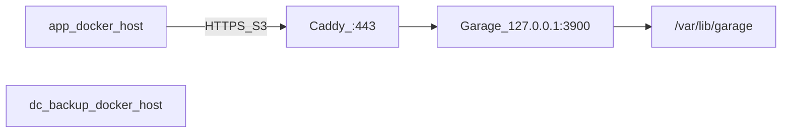

# Closed-DC Garage backup (`dc-backup`)

Deploy a single-node [Garage](https://garagehq.deuxfleurs.fr/) S3 + Caddy TLS on a separate **DC backup host**, and wire app hosts so pgBackRest / restic verify TLS without editing consumer `compose.yml`.

Distinct from DigitalOcean Spaces auto-provision (`pgbr_s3_*` / `restic_write_*` toward Spaces).

**Related docs**

- [README_PGBACKREST.md](README_PGBACKREST.md) — path-style + `repo1-storage-ca-file`
- [README_RESTIC.md](README_RESTIC.md) — `AWS_CA_BUNDLE` on restic docker runs
- [docs/AGENTS_AND_SECRETS.md](docs/AGENTS_AND_SECRETS.md) — keep `dc-backup*.yaml` out of agent context

## Topology



## `info.yaml`

```yaml
docker_host: ssh://root@172.16.92.27
dc_backup_docker_host: ssh://root@172.16.92.28
# env:
#   DOCKER_ADD_HOST: "s3.backup.internal:172.16.92.28"  # only if using a hostname endpoint
#   DC_BACKUP_CA_FILE: /custom/path/ca.crt               # optional override
```

## Runtime knobs

| Key | Purpose |
|-----|---------|
| `DOCKER_ADD_HOST` | Optional `hostname:IPv4` list. Omit when the S3 endpoint is a bare IP. |
| `DC_BACKUP_CA_FILE` | Optional. When unset and `dc-backup-tls.yaml` exists, defaults to `{ops.config_dir}/tls/dc-backup-ca.crt`. |

In-container CA path: `/etc/ssl/dc-backup-ca/ca.crt`.

## Host layout (DC backup machine)

| Path | Role |
|------|------|
| `/opt/garage/docker-compose.yml` | Garage + Caddy |
| `/etc/garage.toml` | Garage config (**file**) |
| `/etc/garage/Caddyfile` | TLS reverse proxy (**file**) |
| `/etc/garage/tls/{ca,server}.{crt,key}` | From `dc-backup tls install` |
| `/var/lib/garage/{meta,data,caddy-data}` | Persistence |

## SOPS

| File | Contents |
|------|----------|
| `docker/envs/<env>/dc-backup-tls.yaml` | CA + server PEMs + SANs |
| `docker/envs/<env>/dc-backup.yaml` | `garage_rpc_secret`, `garage_admin_token`, optional images |

App S3 access keys stay in `credentials.yaml`.

## CLI

```bash
dk prod dc-backup tls issue --ip 172.16.92.28 [--dns NAME] [--days 825] [--force]
dk prod dc-backup tls install
dk prod dc-backup tls status [--check-remote]

dk prod dc-backup bootstrap [--force]
dk prod dc-backup install [--up] [--dry-run]
dk prod dc-backup status [--check-remote]
dk prod dc-backup provision [--print-only] [--force] [--yes] [--dry-run]
  [--bucket NAME] [--key-name NAME] [--endpoint HOST]
  [--pgbr-repo-path PATH] [--restic-prefix PATH] [--capacity SIZE]
```

## Consumer flow

1. Set `dc_backup_docker_host` + app `docker_host`.
2. `dk <env> dc-backup tls issue --ip …` → `tls install`
3. `dk <env> dc-backup bootstrap` → `install --up`
4. `dk <env> dc-backup provision` — creates layout (if needed), bucket, key, and prints a YAML fragment; by default also `sops set`s `pgbr_s3_write_*` / `restic_write_*` after confirm (or `--yes`). Use `--print-only` to skip the SOPS write and paste via `dk <env> secrets`. Use `--dry-run` to preview without Garage or SOPS changes. Re-running is a no-op when WRITE credentials already exist; `--force` overwrites (required when replacing Spaces).
5. Recreate `db`; run `dk <env> db backup` / `files backup`.

Unlike DigitalOcean Spaces, **`dk … db` / `files` do not auto-call `dc-backup provision`** — create Garage bucket/key credentials explicitly with step 4.

Defaults: bucket `{project}-backups`, key `{project}-{env}-backup`, path-style + `verify_tls: y`, endpoint from TLS SAN IP (or `--endpoint`).

Endpoint can be a **bare IP** (IP SAN on the cert) or a **hostname** (`dc-backup tls issue --dns …` plus `DOCKER_ADD_HOST=name:ip` in `info.yaml` `env:` so containers resolve it without DC DNS). Host `/etc/hosts` alone is not enough inside Docker.
