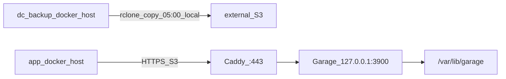

# Closed-DC Garage backup (`dc-backup`)

Deploy a single-node [Garage](https://garagehq.deuxfleurs.fr/) S3 + Caddy TLS on a separate **DC backup host**, and wire app hosts so pgBackRest / restic verify TLS without editing consumer `compose.yml`.

Distinct from DigitalOcean Spaces auto-provision (`pgbr_s3_*` / `restic_write_*` toward Spaces).

**Related docs**

- [README_PGBACKREST.md](README_PGBACKREST.md) — path-style + `repo1-storage-ca-file`
- [README_RESTIC.md](README_RESTIC.md) — `AWS_CA_BUNDLE` on restic docker runs
- [docs/AGENTS_AND_SECRETS.md](docs/AGENTS_AND_SECRETS.md) — keep `dc-backup*.yaml` out of agent context

## Topology



## `info.yaml`

```yaml
docker_host: ssh://root@172.16.92.27
dc_backup_docker_host: ssh://root@172.16.92.28
# env:
#   DOCKER_ADD_HOST: "s3.backup.internal:172.16.92.28"  # only if using a hostname endpoint
#   DC_BACKUP_CA_FILE: /custom/path/ca.crt               # optional override
```

## Runtime knobs

| Key | Purpose |
|-----|---------|
| `DOCKER_ADD_HOST` | Optional `hostname:IPv4` list. Omit when the S3 endpoint is a bare IP. |
| `DC_BACKUP_CA_FILE` | Optional. When unset and `dc-backup-tls.yaml` exists, defaults to `{ops.config_dir}/tls/dc-backup-ca.crt`. |

In-container CA path: `/etc/ssl/dc-backup-ca/ca.crt`.

## Host layout (DC backup machine)

| Path | Role |
|------|------|
| `/opt/garage/docker-compose.yml` | Garage + Caddy |
| `/etc/garage.toml` | Garage config (**file**) |
| `/etc/garage/Caddyfile` | TLS reverse proxy (**file**) |
| `/etc/garage/tls/{ca,server}.{crt,key}` | From `dc-backup tls install` |
| `/var/lib/garage/{meta,data,caddy-data}` | Persistence |
| `{ops.install_prefix}/rclone-garage-offsite.sh` | Offsite copy script |
| `{ops.config_dir}/rclone-garage-offsite.env` | Offsite EnvironmentFile |
| `{ops.install_prefix}/garage-s3` | AWS CLI → local Garage (`127.0.0.1:3900`) |
| `{ops.install_prefix}/garage-admin` | `docker exec garage /garage …` |
| `{ops.config_dir}/garage-s3.env` | S3 WRITE keys (+ optional `GARAGE_ADMIN_TOKEN`) |

## SOPS

| File | Contents |
|------|----------|
| `docker/envs/<env>/dc-backup-tls.yaml` | CA + server PEMs + SANs |
| `docker/envs/<env>/dc-backup.yaml` | `garage_rpc_secret`, `garage_admin_token`, optional images |

App S3 access keys and optional `offsite_s3_*` stay in `credentials.yaml`.

## CLI

```bash
dk prod dc-backup tls issue --ip 172.16.92.28 [--dns NAME] [--days 825] [--force]
dk prod dc-backup tls install
dk prod dc-backup tls status [--check-remote]

dk prod dc-backup bootstrap [--force]
dk prod dc-backup install [--up] [--dry-run]
dk prod dc-backup status [--check-remote]
dk prod dc-backup provision [--print-only] [--force] [--yes] [--dry-run]
  [--bucket NAME] [--key-name NAME] [--endpoint HOST]
  [--pgbr-repo-path PATH] [--restic-prefix PATH] [--capacity SIZE]

dk prod dc-backup offsite install [--enable] [--yes] [--dry-run]
dk prod dc-backup offsite run [--dry-run]
dk prod dc-backup offsite status
```

## Consumer flow

1. Set `dc_backup_docker_host` + app `docker_host`.
2. `dk <env> dc-backup tls issue --ip …` → `tls install`
3. `dk <env> dc-backup bootstrap` → `install --up`
4. `dk <env> dc-backup provision` — creates layout (if needed), bucket, key, and prints a YAML fragment; by default also `sops set`s `pgbr_s3_write_*` / `restic_write_*` after confirm (or `--yes`). Use `--print-only` to skip the SOPS write and paste via `dk <env> secrets`. Use `--dry-run` to preview without Garage or SOPS changes. Re-running is a no-op when WRITE credentials already exist (still refreshes host `garage-s3` / `garage-admin`); `--force` overwrites (required when replacing Spaces). Provision looks up keys by friendly name first and grants bucket rights by **Key ID** (Garage allows duplicate names; a prior bug could mint extras — delete duplicates with `garage key list` / `key delete <KeyID>` if provision reports matching keys).
5. Recreate `db`; run `dk <env> db backup` / `files backup`.
6. Optional offsite: set `offsite_s3_*` → `dk <env> dc-backup offsite install --enable`.
7. Optional Zabbix on the backup host: set `zbx_hostname_backup` (or pass `--hostname`) → `dk <env> zabbix --target backup install` → `enable` / `restart`. See [ZABBIX_README.md](ZABBIX_README.md).

Unlike DigitalOcean Spaces, **`dk … db` / `files` do not auto-call `dc-backup provision`** — create Garage bucket/key credentials explicitly with step 4.

Defaults: bucket `{project}-backups`, key `{project}-{env}-backup`, path-style + `verify_tls: y`, endpoint from TLS SAN IP (or `--endpoint`).

**Host S3 CLI:** provision installs `{ops.install_prefix}/garage-s3` (prefers host `aws`, else `docker run amazon/aws-cli`) and `garage-admin`, and symlinks them into `/usr/local/bin`. Examples on the backup host:

```bash
garage-s3 s3 ls s3://indmo-backups/ --recursive
# or: /opt/indmo/garage-s3 s3 ls s3://indmo-backups/ --recursive
garage-admin status
garage-admin key list
```

Endpoint can be a **bare IP** (IP SAN on the cert) or a **hostname** (`dc-backup tls issue --dns …` plus `DOCKER_ADD_HOST=name:ip` in `info.yaml` `env:` so containers resolve it without DC DNS). Host `/etc/hosts` alone is not enough inside Docker.

## Offsite copy (Garage → external S3)

Daily **05:00** (backup host **system/local** timezone — systemd `OnCalendar` without UTC) `rclone copy` on `dc_backup_docker_host` (after app-host backups). Keep the backup host clock/timezone aligned with the app host. Source is Garage at `http://127.0.0.1:3900` (path-style). Destination is generic external S3.

**Why `copy` not `sync`:** if Garage is wiped, `sync` would delete matching keys offsite; `copy` only adds/updates keys present on the source, so prior offsite objects remain. Keys present on both sides can still be overwritten.

### Credentials

Requires Garage WRITE keys from `provision` plus:

```yaml
offsite_s3_bucket: …
offsite_s3_region: …                 # e.g. sgp1
offsite_s3_endpoint: …               # e.g. sgp1.digitaloceanspaces.com; omit for AWS default
offsite_s3_access_key_id: …
offsite_s3_secret_access_key: …
# offsite_s3_prefix: ""              # default empty (same key layout as Garage — easiest restore)
# offsite_s3_provider: Other         # rclone S3 provider
```

### Restore from offsite

Use existing READ flows. Clear WRITE prefixes first (tooling rejects WRITE+READ together). Prefer empty `offsite_s3_prefix`.

**pgBackRest** — `dk <env> db restore`:

```yaml
pgbr_s3_read_bucket: <offsite_s3_bucket>
pgbr_s3_read_region: <offsite_s3_region>
pgbr_s3_read_endpoint: <offsite_s3_endpoint>
pgbr_s3_read_uri_style: path
pgbr_s3_read_key: <offsite access key>
pgbr_s3_read_secret: <offsite secret>
pgbr_s3_read_repo_path: /{project}/{env}/pgbackrest   # same as Garage WRITE
pgbr_s3_read_stanza: main
```

**restic** — `dk <env> files restore`:

```yaml
restic_read_repository: s3:<offsite_endpoint>/<offsite_bucket>/<restic_prefix>
restic_read_password: <same restic_write_password>
restic_read_s3_access_key_id: <offsite access key>
restic_read_s3_secret_access_key: <offsite secret>
restic_read_s3_default_region: <offsite_s3_region>
```

If `offsite_s3_prefix` is set, prepend it to `repo_path` / the restic repository path.
