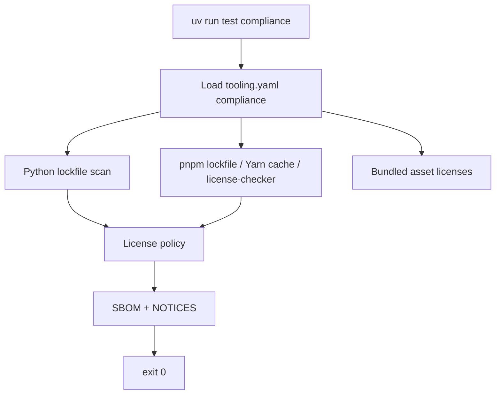

# OSS compliance (`test compliance`)

License inventory, SBOM generation, and policy gate for **consumer repos** that use catalpa-workspace-tooling. Tooling orchestrates scans; each project holds a `compliance:` block in `tooling.yaml` and committed artifacts under `compliance/`.

**Requires:** catalpa-workspace-tooling **v0.10.0** or newer.

## Overview

| | |
|---|---|
| **Command** | `uv run test compliance` |
| **Purpose** | Scan production Python/JS deps, bundled assets; write SBOM + `THIRD_PARTY_NOTICES.md` |
| **CI gate** | `uv run test compliance --check-only --ci` |
| **When to run** | After dependency or submodule bumps; before release tags |

## What tooling runs

Pipeline (`compliance_cli.run_compliance`):

1. Load `compliance:` from `tooling.yaml` (or infer JS-only mode when `paths.frontend/` has a JS lockfile)
2. **Python** — `uv export` from configured lockfiles, then `pip-licenses` (host `compliance` group)
3. **JavaScript** — `pnpm-lock.yaml` with `production_only` closure (licenses from `node_modules`; fallback: `pnpm dlx license-checker`); legacy Yarn Berry `.yarn/cache` scan; npm via `npx license-checker`
4. **Metadata** — required project license files exist; warn on `package.json` / `pyproject.toml` drift
5. **Bundled assets** — font/binary dirs must contain license files matching configured globs
6. **Policy** — forbidden / warn SPDX tiers
7. **Artifacts** — CycloneDX JSON under `compliance/sbom/`, merged `bom.cdx.json`, `compliance/THIRD_PARTY_NOTICES.md`



## Command flags

| Flag | Behavior |
|------|----------|
| *(default)* | Regenerate and write `compliance/` artifacts |
| `--check-only` | No writes; fail on policy violations, missing config, or stale committed artifacts |
| `--sbom-only` | Regenerate SBOM files only (skip metadata, bundled assets, and policy) |
| `--ci` | CI mode (non-interactive) |

## Project prerequisites

### Required (full stack: Python + JavaScript)

| Requirement | Where |
|-------------|-------|
| `compliance:` block | `tooling.yaml` |
| `[dependency-groups].compliance` | **consumer repo root** `pyproject.toml` |
| Python production lockfile | Path(s) under `compliance.python.lockfiles` (e.g. `{frontend}/docker/uv.lock`) |
| JS lockfile | Under `compliance.javascript.cwd` (default: `paths.frontend`) |
| Project / platform license file(s) | `compliance.license_files` |
| Font / bundled asset licenses | `compliance.bundled_assets` — **list** of `{ path, license_globs }` |

### Consumer `pyproject.toml`

Host-only compliance packages belong in the **consumer repo root**, not in runtime/submodule `pyproject.toml` (same pattern as smoke tests — keeps Docker image lockfiles lean).

```toml
[tool.uv]
default-groups = ["tooling", "dev", "compliance"]

[dependency-groups]
compliance = [
    "cyclonedx-bom>=5",
    "pip-licenses>=5",
]
```

Then:

```bash
uv sync
uv run test compliance
uv run test compliance --check-only
```

## `tooling.yaml` schema

Paths are relative to the **consumer repo root**. Use `paths.frontend` (see `tooling.yaml` `paths:`) for the frontend tree — often a git submodule, but any directory works.

```yaml
compliance:
  project_license: AGPL-3.0-or-later   # or Apache-2.0, etc.
  license_files:
    - platform/LICENSE                # submodule or monorepo platform tree
  python:
    lockfiles:
      - platform/docker/uv.lock       # production image lockfile(s)
  javascript:
    cwd: platform                      # usually same as paths.frontend
    lockfile: pnpm-lock.yaml
    production_only: true
  bundled_assets:                    # list — one or more directories
    - path: platform/src/fonts
      license_globs: ["*OFL*", "LICENSE*", "COPYING*"]
    # - path: platform/src/icons     # add entries as needed
    #   license_globs: ["LICENSE*", "COPYING*"]
  forbidden_spdx:
    - LicenseRef-proprietary
    - UNLICENSED
  warn_spdx:
    - GPL-2.0-only
    - GPL-3.0-only
    - UNKNOWN
  allow_strong_copyleft: false         # true when GPL-family deps are expected in platform lockfiles
  outputs:
    sbom_dir: compliance/sbom
    notices: compliance/THIRD_PARTY_NOTICES.md
```

When `compliance:` is omitted, tooling infers a **JS-only** minimal config if `paths.frontend/` contains `pnpm-lock.yaml`, `yarn.lock`, or `package-lock.json`. `pnpm-lock.yaml` is preferred when multiple lockfiles exist.

### Workspace / uv notes

- **`[tool.uv] exclude-dependencies`** — uv reads this from the **workspace root** `pyproject.toml` only. Mirror platform-level excludes in the consumer root when using a uv workspace.
- **`uv export` for lockfiles** — when a lockfile lives at `{frontend}/docker/uv.lock`, tooling resolves the matching `pyproject.toml` in the parent of `docker/`.

## Forbidden-license policy (defaults)

| Tier | SPDX examples | `--check-only` behavior |
|------|---------------|-------------------------|
| Deny | `UNLICENSED`, `LicenseRef-proprietary` | Fail |
| Warn | `GPL-2.0-only`, `GPL-3.0-only`, `UNKNOWN` | Fail in `--check-only`; pass in default write mode |
| Allow | `MIT`, `Apache-2.0`, `BSD-*`, `ISC`, `LGPL-*`, `AGPL-3.0-or-later` | Pass |

Override tiers in `tooling.yaml`. Set `allow_strong_copyleft: true` when your **platform** lockfiles may include GPL-family libraries and you accept honoring each library’s terms (notices, and sometimes source for that library) without automated GPL warn lines.

**License normalization:** Python scanners often return verbose names (e.g. `GNU General Public License v2 (GPLv2)`) instead of SPDX ids. Tooling maps common phrases to SPDX-style identifiers before policy checks and when writing notices. Compound expressions (`;`, ` AND `) are split and normalized per token.

Warn-tier packages should be tracked in project-specific docs (e.g. a flagged-dependencies register) before using `--check-only` as a merge gate.

## Generated artifacts (commit these)

| Path | Contents |
|------|----------|
| `compliance/THIRD_PARTY_NOTICES.md` | Human-readable dependency table |
| `compliance/sbom/python-*.cdx.json` | CycloneDX from Python lockfiles |
| `compliance/sbom/javascript.cdx.json` | CycloneDX stub from JS license scan |
| `compliance/sbom/bom.cdx.json` | Merged CycloneDX |

Regenerate after dependency bumps; CI `--check-only` fails if committed files drift.

## CI (optional)

Copy [`scripts/compliance-workflow.yml.template`](../scripts/compliance-workflow.yml.template) to `.github/workflows/compliance.yml` in the consumer repo. Adjust branch names and submodule checkout (PAT) for private submodules.

## Example: Bero platform consumers

Early adopters (catalpa_bero, jid, ncd, tvi) embed **bero** as `paths.frontend: bero`. Typical config:

| Field | Bero consumer value |
|-------|---------------------|
| `license_files` | `bero/LICENSE` |
| `python.lockfiles` | `bero/docker/uv.lock` |
| `javascript.cwd` | `bero` |
| `bundled_assets` | `[{ path: bero/src/fonts, license_globs: [...] }]` (list; one entry today) |

Do **not** add `cyclonedx-bom` / `pip-licenses` to `bero/pyproject.toml` — use the consumer root only.

Project checklists and copyleft registers live in each consumer repo (`docs/OSS_COMPLIANCE.md`, platform submodule docs). Bero’s template: `bero/docs/OSS_COMPLIANCE.md`, `bero/docs/FLAGGED_DEPENDENCIES.md`.

## Related docs

- Smoke tests (similar host-dep pattern): [docs/SMOKE_TESTS.md](SMOKE_TESTS.md)
- Cursor agent rule template: `scripts/cursor-rules/oss-compliance.mdc`
