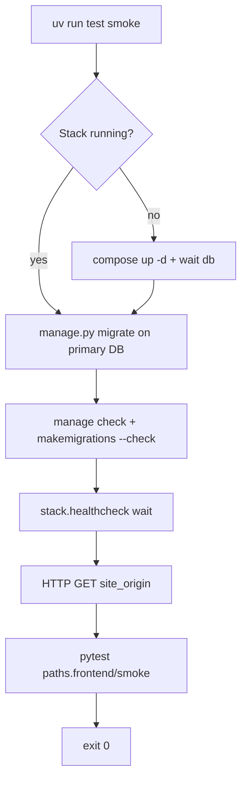

# Smoke tests (`test smoke`)

Fast project-health checks for Django + Docker Compose stacks. Tooling orchestrates the stack; your repo supplies tests under `{paths.frontend}/smoke/`.

**Requires:** catalpa-workspace-tooling **v0.8.1** or newer.

## Overview

| | |
|---|---|
| **Command** | `uv run test smoke` (or `test smoke` when the project venv is on `PATH`) |
| **Purpose** | Post-change gate (~2 min): stack up, migrations, Django checks, web healthcheck, frontend HTTP, Playwright tests |
| **When to run** | After submodule bumps, before merge; locally first (CI optional later) |

## What tooling runs

Ordered pipeline (implemented in `smoke_cli.run_smoke`):

1. Resolve `docker/envs/<env>/info.yaml` and compose file
2. Optional `docker compose up -d` (skip with `--no-up`); when starting the stack, run **`ensure_volumes`**, local **`compose build`** (when not using pinned registry images), and **`materialize_configs`** — same preflight as `dk <env> up`
3. Wait for Postgres (`pg_isready`)
4. Optional `--fresh-db`: migrate on ephemeral `{dbname}_smoke_empty` (local only; ignored with `--ci`)
5. Primary DB: `compose exec <web> ./manage.py migrate` (`--check-only` → `migrate --check`)
6. `manage check`
7. `makemigrations --check --dry-run`
8. Wait for `stack.healthcheck` on the web service
9. Poll HTTP GET `{site_origin}/` until 2xx/3xx (up to 120s; webpack dev first compile can block ~60s)
10. `uv run --group smoke pytest {paths.frontend}/smoke` with `SMOKE_FE_URL` set



Migrations run **inside the web container** (`compose exec`), not via `native manage` — same env as deploy and `dk dev`.

## Port allocation

Dev smoke tests use `site_origin` from `docker/envs/dev/info.yaml` (port **901N**). See **`bero/docs/PORTS.md`** in the consumer repo for the full 7-port scheme.

## Project prerequisites

### Required

| Requirement | Where | Notes |
|-------------|-------|-------|
| Valid `tooling.yaml` | repo root | Same manifest as `dk` / other `test` subcommands |
| `stack.services.web` + `stack.services.db` | `tooling.yaml` | Web container must expose `./manage.py` |
| `stack.healthcheck` | `tooling.yaml` | URL when app is healthy (bero: `/cms/`; generic: `/healthz`) |
| `site_origin` | `docker/envs/dev/info.yaml` | HTTP probe + `SMOKE_FE_URL`; string or list OK |
| Dev compose stack | env `info.yaml` | Usually `compose.dev.yaml` via `paths.deploy.dev_compose` |
| `{paths.frontend}/smoke/` | e.g. `bero/smoke/` | **Missing directory → smoke fails at step 10** |
| `[dependency-groups].smoke` | consumer `pyproject.toml` | `pytest`, `pytest-playwright`; not in Django image pyproject |
| Playwright browser (one-time) | host | `uv run playwright install chromium` |

### Recommended

- `[tool.uv] default-groups` includes `"smoke"` so direnv `uv sync` keeps Playwright installed
- Root `pytest.ini`: `testpaths = bero/smoke` (or your smoke path); omit `DJANGO_SETTINGS_MODULE` unless smoke tests use pytest-django
- Pin `catalpa-workspace-tooling` at `v0.8.1` or newer

## Consumer `pyproject.toml`

Host-only smoke packages belong in the **consumer repo root**, not in submodule/runtime `pyproject.toml` (bero projects: see `bero/docs/cursor-rules/bero-deps.mdc`).

```toml
[tool.uv]
default-groups = ["tooling", "dev", "smoke"]

[dependency-groups]
smoke = [
    "pytest>=8.4",
    "pytest-playwright>=0.5",
]
```

Then:

```bash
uv sync
uv run playwright install chromium   # one-time per machine
```

## Writing smoke tests

### Location

`{repo_root}/{paths.frontend}/smoke/`

Today this is always `config.frontend_dir / "smoke"` (no `tooling.yaml` override yet). For bero consumers, `paths.frontend` is typically `bero`, so tests live at `bero/smoke/`.

### Environment

Tooling sets **`SMOKE_FE_URL`** (base URL, no trailing slash required). Tests must not hardcode ports.

### Minimal `conftest.py`

Reference copy: [`tests/fixtures/minimal_project/frontend/smoke/conftest.py`](../tests/fixtures/minimal_project/frontend/smoke/conftest.py).

```python
import os

import pytest


@pytest.fixture(scope="session")
def browser_type_launch_args() -> dict:
    return {"headless": True}


@pytest.fixture
def fe_url() -> str:
    url = (os.environ.get("SMOKE_FE_URL") or "").strip()
    if not url:
        pytest.skip("SMOKE_FE_URL not set (run via `uv run test smoke`)")
    return url.rstrip("/")
```

### Test types

| Type | Example | When |
|------|---------|------|
| HTTP only | `urllib` GET on `fe_url` | Any stack; no browser |
| Playwright | Assert DOM / PWA spinner | SPA / PWA shell |

Bero shared tests (in submodule):

- `bero/smoke/test_backend.py` — HTTP root responds
- `bero/smoke/test_pwa_load.py` — `#service-worker-loading` visible then hidden

### Conventions

- File names: `test_*.py`
- Do not use pytest-django for migrations — tooling runs migrate in the container
- Keep tests fast and read-only (no writes via browser)
- Extra pytest args: `uv run test smoke -- -k pwa -vv`

## Bero consumer fast path

For catalpa_bero, jid, ncd, tvi:

1. Bump **bero** submodule to a commit containing `bero/smoke/`
2. Add smoke group + `pytest.ini` + copy `.cursor/rules/bero-deps.mdc` from bero docs
3. `uv sync && uv run playwright install chromium`
4. `uv run dk dev up -d && uv run test smoke --no-up`

No project-specific test code — reuse submodule tests. Optional wrapper: `bero/scripts/smoke.sh`.

See also [bero/README_TESTING.md](https://github.com/catalpainternational/bero/blob/dev-7.4/README_TESTING.md) for bero-specific notes and E2E (Behave).

## Non-bero / custom projects

1. Create `{paths.frontend}/smoke/` with `conftest.py` and at least one HTTP test (copy from [minimal fixture](../tests/fixtures/minimal_project/frontend/smoke/))
2. Set `stack.healthcheck.url` to a route your web container serves
3. Set `site_origin` in dev `info.yaml` to the URL users hit (proxy port, e.g. dev `:901N` — see `bero/docs/PORTS.md`)
4. Add smoke dependency group (above)
5. Run `uv run test smoke`

### Known bero-leaning defaults

These work for all stacks but use bero-oriented fallbacks:

| Default | Value |
|---------|-------|
| `--fresh-db` DB name | `bero_db` if `DJANGO_DB` / `POSTGRES_DB` unset |
| `--fresh-db` DB owner | `bero` if `DJANGO_DB_USER` / `POSTGRES_USER` unset |
| FE URL fallback | `http://127.0.0.1:9011/` if `site_origin` missing |
| Missing smoke dir message | mentions "bero submodule smoke tests" |

Future v2 may add `tooling.yaml` keys: `smoke.pytest_dir`, `smoke.skip_playwright`, configurable DB fallbacks.

## Flags

| Flag | Behavior |
|------|----------|
| `--env dev` | Deploy env folder under `docker/envs/` (default: `dev`) |
| `--no-up` | Skip `docker compose up -d` (stack already running) |
| `--check-only` | Use `migrate --check` instead of `migrate --noinput` |
| `--fresh-db` | Ephemeral empty DB migrate (local only) |
| `--ci` | Ignore `--fresh-db`; assume primary DB is already empty |
| `-- …` | Arguments forwarded to pytest |

## Troubleshooting

| Symptom | Likely cause |
|---------|----------------|
| `missing …/smoke` | No test directory under `paths.frontend` |
| Playwright not found after direnv | Add `smoke` to `[tool.uv] default-groups` |
| `SMOKE_FE_URL not set` | Ran `pytest` directly instead of `uv run test smoke` |
| Healthcheck timeout | Wrong `stack.healthcheck.url`, web not up, or **DisallowedHost** when `BERO_ORIGIN` is not `localhost` (fixed in tooling v0.8.3+: in-container probe sends `Host` from `BERO_ORIGIN`) |
| FE URL did not respond | `site_origin` / proxy port mismatch; dev webpack still compiling (fixed in v0.8.5+: smoke polls up to 120s) |
| `treebeard.E001` in container only | Native vs docker lock drift (bero: `bero/docs/PYTHON_LOCK_ALIGNMENT.md`) |
| `dk build django` fails after adding smoke to bero pyproject | Smoke deps belong in consumer `pyproject.toml` only |

## CI (future)

Not wired in v1. Intended shape:

```yaml
- run: uv run dk dev up -d
- run: uv run test smoke --no-up --ci
```

Use `--ci` when the job starts with an empty primary database volume.

## Related docs

| Document | Contents |
|----------|----------|
| [README.md](../README.md) | Install and command overview |
| [docs/AGENTS_AND_SECRETS.md](AGENTS_AND_SECRETS.md) | Cursor rules including optional `smoke-tests.mdc` |
| bero `README_TESTING.md` | Bero usage, Behave E2E, unit tests |
| bero `docs/cursor-rules/bero-deps.mdc` | Where smoke deps must live for bero consumers |
