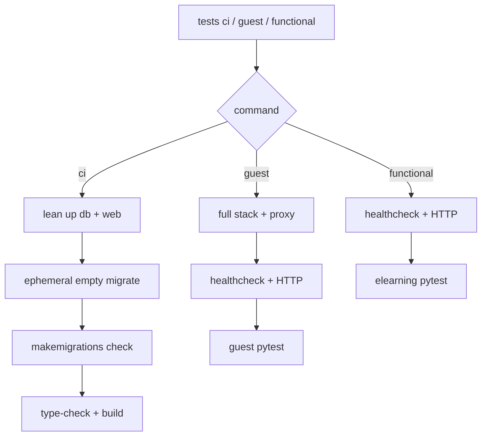

# Smoke / CI / functional tests (`tests ci`, `tests guest`, `tests functional`)

Project-health and Playwright checks for Django + Docker Compose stacks. Tooling orchestrates the stack; your repo supplies tests under `{paths.frontend}/smoke/`.

**Requires:** catalpa-workspace-tooling with `tests ci` / `tests guest` / `tests functional` (formerly `tests smoke`).

## Overview

| Command | Role |
|---------|------|
| `uv run tests ci` | CI gate: lean **db + django** up, **empty migrate** (ephemeral DB), makemigrations check, frontend type-check/build. **No Playwright.** |
| `uv run tests guest` | Guest Playwright against a **full** stack + local_proxy (skips CI gate) |
| `uv run tests functional` | Skip gate; Playwright against an **existing** DB / running stack (`-m elearning` by default) |
| `uv run tests functional headed` | Same, visible browser with default slow-mo (250 ms) |
| `uv run dk <env> manage migrate` | Migrate the **primary** (existing) database |
| `uv run tests smoke` | **Deprecated** alias for `tests ci` (or `tests smoke --functional` → functional) |

Everyday CI gate (local or GitHub Actions):

```bash
uv run tests ci
```

Defaults to `--env dev` and starts a **lean** stack (`db` + web). No extra flags required.

## What tooling runs

### CI gate (`tests ci`)

Ordered pipeline (implemented in `smoke_cli.run_smoke`):

1. Resolve `docker/envs/<env>/info.yaml` and compose file (default env: `dev`)
2. Optional lean `docker compose up -d db <web>` (skip with `--no-up`); builds only `db`, web, and `node` images; **no** local_proxy / caddy / metabase / redis
3. Wait for Postgres (`pg_isready`)
4. **Empty migrate** on ephemeral `{dbname}_smoke_empty` (migrate + `manage check`), then drop it — **never touches the primary DB**
5. `makemigrations --check --dry-run`
6. **Frontend type-check + production build** — prefer `docker compose run --no-deps node pnpm run …` when a `node` service exists (image `node_modules`); otherwise host package manager under `paths.frontend`

### Guest (`tests guest`)

Skips the migrate / makemigrations / frontend-build gate. Starts the **full** stack + local_proxy (unless `--no-up`), waits for HTTP, then runs guest pytest under `{paths.frontend}/smoke` (elearning skipped unless you pass a marker).

### Functional (`tests functional` / `tests functional headed`)

Same Playwright wait path as guest, but defaults to `-m elearning`. `headed` adds `--headed --slowmo=250` (override with your own `--slowmo=`). Use against a fetched/restored primary DB.



## Port allocation

Dev tests use `site_origin` from `docker/envs/dev/info.yaml` (port **901N**). See **`bero/docs/PORTS.md`**.

## Project prerequisites

### Required for CI gate

| Requirement | Where | Notes |
|-------------|-------|-------|
| Valid `tooling.yaml` | repo root | Same manifest as `dk` / other `tests` subcommands |
| `stack.services.web` + `stack.services.db` | `tooling.yaml` | Web container must expose `./manage.py` |
| Compose `node` service (recommended) | e.g. `compose.dev.yaml` | CI gate runs type-check/build here; avoids host `pnpm install` |

### Required for guest / functional Playwright

| Requirement | Where | Notes |
|-------------|-------|-------|
| `stack.healthcheck` | `tooling.yaml` | URL when app is healthy (bero: `/cms/`) |
| `site_origin` | `docker/envs/dev/info.yaml` | HTTP probe + `SMOKE_FE_URL` |
| `{paths.frontend}/smoke/` | e.g. `bero/smoke/` | Missing directory → failure |
| `[dependency-groups].smoke` | consumer `pyproject.toml` | `pytest`, `pytest-playwright` |
| Playwright browser (one-time) | host | `uv run playwright install chromium` |

### Recommended

- `[tool.uv] default-groups` includes `"smoke"` when you run Playwright locally
- Root `pytest.ini`: `testpaths = bero/smoke`

## Consumer `pyproject.toml`

```toml
[tool.uv]
default-groups = ["tooling", "dev", "smoke"]

[dependency-groups]
smoke = [
    "pytest>=8.4",
    "pytest-playwright>=0.5",
]
```

```bash
uv sync
uv run playwright install chromium   # only needed for guest / functional
```

### GitHub Actions (tooling only — CI gate)

Host does not need the Django/bero workspace package, Playwright, or a host Node install when compose provides `node`:

```bash
uv sync --frozen --only-group tooling
uv run --no-sync tests ci
```

Use ``--no-sync`` so ``uv run`` does not pull workspace ``bero`` / default groups (Django, Playwright, …) onto the runner. Same empty-migrate semantics as local. Primary DB migrate stays on `dk <env> manage migrate` when you need it.

Host `uv`/pnpm installs do **not** populate Docker BuildKit cache mounts (`/root/.cache/uv`, pnpm store); those stay inside image builds.

## Writing smoke tests

Location: `{repo_root}/{paths.frontend}/smoke/`. Tooling sets **`SMOKE_FE_URL`**.

Extra pytest args: `uv run tests guest -- -k pwa -vv`

## Bero consumer fast path

```bash
uv run tests ci
uv run tests guest --no-up
uv run tests functional --no-up
uv run tests functional headed --no-up
```

See [bero/README_TESTING.md](https://github.com/catalpainternational/bero/blob/dev-7.4/README_TESTING.md).

## Flags

### `tests ci`

| Flag | Behavior |
|------|----------|
| `--env dev` | Deploy env under `docker/envs/` (default: `dev`) |
| `--no-up` | Skip lean `docker compose up -d` |
| `--check-only` | Ephemeral empty migrate uses `migrate --check` |

### `tests guest` / `tests functional`

| Flag / mode | Behavior |
|-------------|----------|
| `--env` / `--no-up` | Same as CI (guest/functional start the **full** stack when up is needed) |
| `headed` (functional) | `--headed --slowmo=250` unless overridden |
| `-- …` | Forwarded to pytest |

## Related docs

| Document | Contents |
|----------|----------|
| [README.md](../README.md) | Install and command overview |
| bero `README_TESTING.md` | Bero usage, elearning / functional tests |
| bero `docs/cursor-rules/bero-deps.mdc` | Where smoke deps must live |
